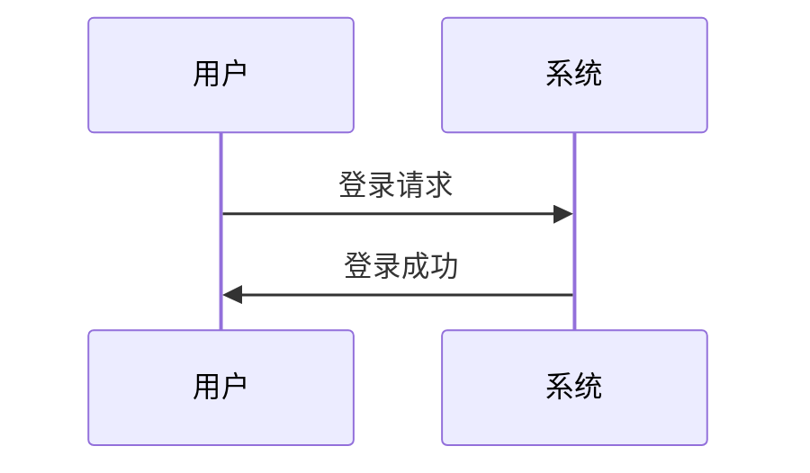
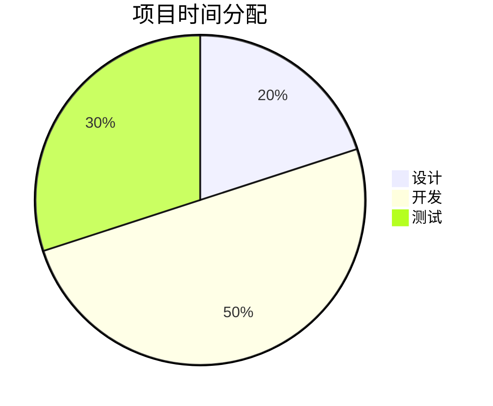

# 测试 mermaid

```mermaid
sequenceDiagram
    participant A as 用户
    participant B as 系统
    A->>B: 登录请求
    B->>A: 登录成功
```

```mermaid
pie title 项目时间分配
    "设计" : 20
    "开发" : 50
    "测试" : 30
```